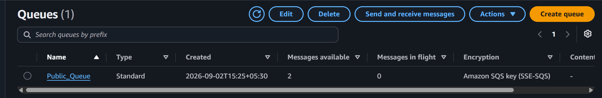
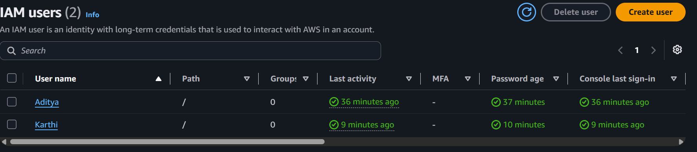
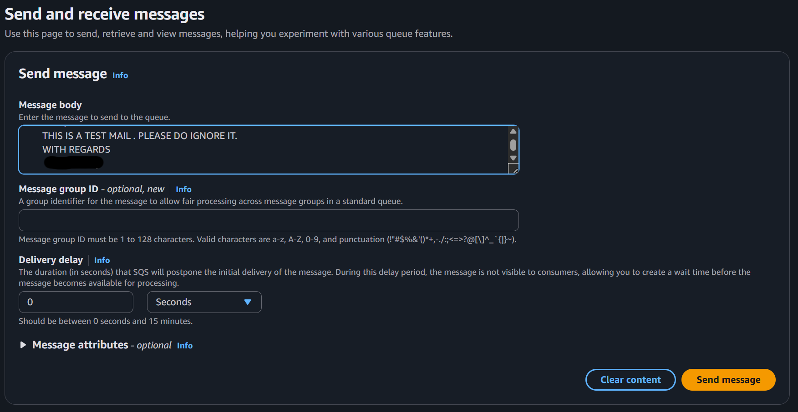
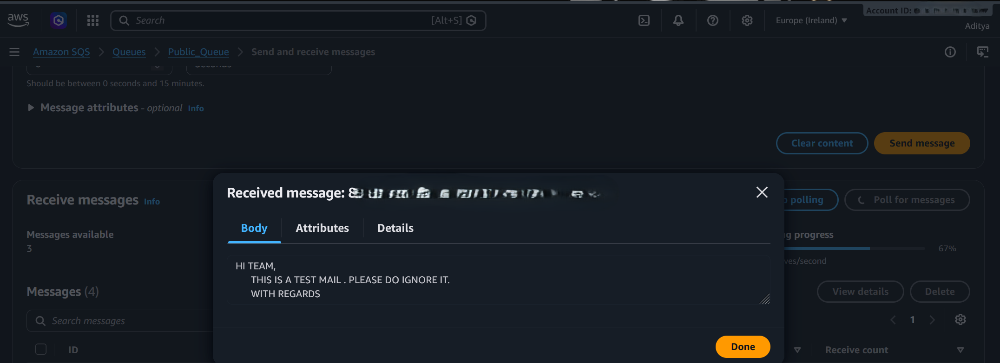
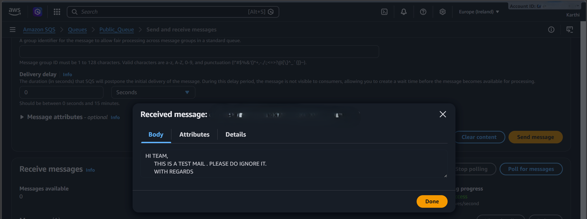

                                AWS SQS Multi-User Polling

Project Overview
This project demonstrates how to implement asynchronous message processing and distributed workload decoupling using Amazon Simple Queue Service (SQS) and AWS Identity and Access Management (IAM).

The primary objective is to simulate a multi-entity architecture where decoupled users or services securely interact with a centralized queue to publish and poll messages without tight service coupling.

Services Used
- Amazon SQS (Simple Queue Service)
- AWS IAM (Identity and Access Management)
- AWS Management Console

Configuration Details
Parameter | Configuration
AWS Region | Europe (Ireland) eu-west-1
Queue Name | Public_Queue
Queue Type | Standard Queue
Encryption | Amazon SQS Key (SSE-SQS)
IAM Users | Aditya, Karthi
Access Model | Multi-User Polling & Publishing

Step 1 - Provision IAM Identities
Configured discrete IAM user identities to simulate separate publishers and consumers in a distributed environment:
- Aditya
- Karthi

Step 2 - Create the Standard SQS Queue
Provisioned a general-purpose Standard Amazon SQS queue named Public_Queue in eu-west-1 with server-side encryption enabled (SSE-SQS) to act as the centralized message broker.

Step 3 - Dispatch Test Payloads
Simulated upstream service publishing by generating and sending messages to the queue payload buffer:
- Sent formatted test messages into Public_Queue.
- Verified incrementation in the Messages available metric on the SQS dashboard.

Step 4 - Multi-User Message Polling & Verification
Verified decoupled message consumption across independent console sessions:
- Initiated polling from the Aditya user session and verified successful receipt of message payload ID 8fd90a98-2b1a-4f9b-be14-6684095e14a8.
- Initiated polling from the Karthi user session and retrieved payload ID e7a83c04-5979-4aea-b1a4-fa44c8749b29.
- Validated message body persistence, delivery delay handling, and visibility attributes.

Project Verification & Screenshots
Step 01 - Active Standard SQS Queue (Public_Queue):

Step 02 - IAM User Identities (Aditya, Karthi):

Step 03 - Test Payload Dispatch via Console:

Step 04 - Polled Message Verification (Aditya):

Step 05 - Polled Message Verification (Karthi):

Testing & Verification
- Confirmed that Public_Queue reliably receives and stores incoming message payloads asynchronously.
- Verified that message states transition accurately from Available to In-flight upon polling.
- Validated that distinct IAM users can access the shared queue infrastructure to send and poll messages.
- Verified full visibility and payload integrity directly across the AWS SQS Management Console.

Learning Outcomes
- Configured and managed Amazon SQS Standard queues.
- Implemented architectural decoupling between message producers and consumers.
- Managed multi-user queue access using AWS IAM operational controls.
- Handled message lifecycle operations including delivery delay, message bodies, and polling mechanisms.

Author

ADITYA MANIVANNAN

AWS Cloud | DevOps Engineer
